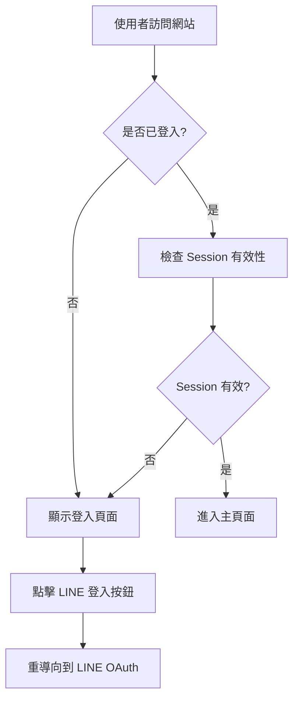
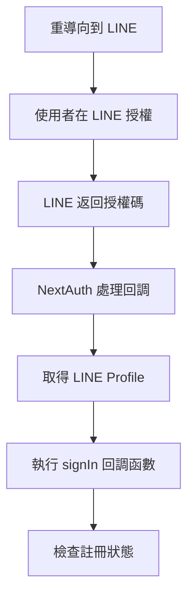
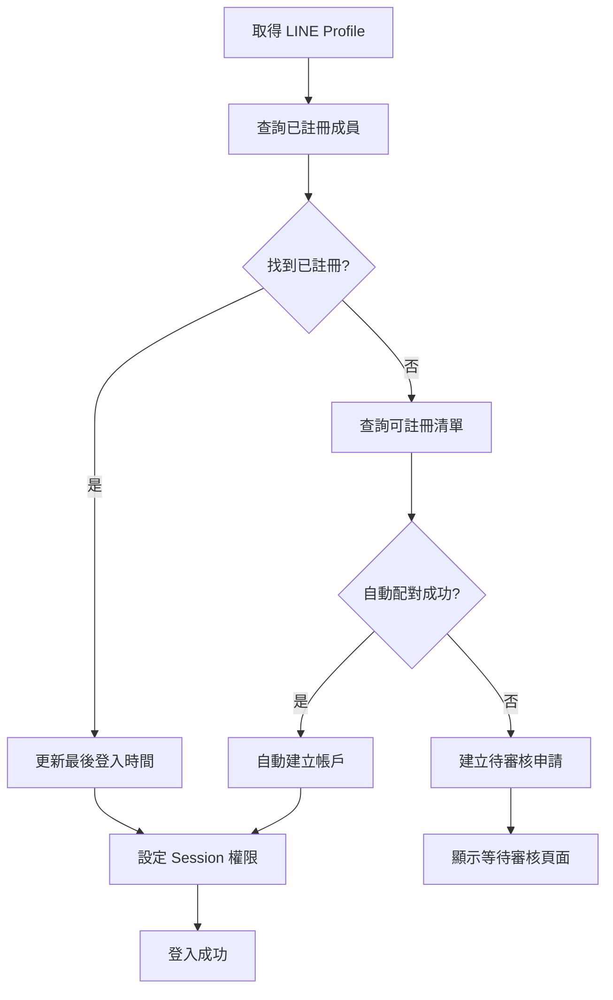

# LINE 認證流程設計

## 🔐 認證系統概覽

本系統採用 LINE Login 作為主要認證方式，結合 NextAuth.js 框架實作完整的使用者身份驗證和權限管理系統。

**核心優勢**:
- ✅ 台灣使用者普及率極高
- ✅ 一鍵登入，使用體驗佳
- ✅ 免費使用，無額外成本
- ✅ 官方 OAuth 2.0 標準，安全可靠

## 🏗 技術架構

### 核心技術棧
```
前端認證: NextAuth.js + LINE Provider
後端驗證: JWT Token + Session 管理
權限控制: Role-based Access Control (RBAC)
資料儲存: Google Sheets + 瀏覽器 Session
```

### 環境變數配置
```bash
# LINE Login 設定
LINE_CHANNEL_ID=your_line_channel_id
LINE_CHANNEL_SECRET=your_line_channel_secret

# NextAuth 設定
NEXTAUTH_SECRET=your_super_secret_key
NEXTAUTH_URL=https://your-domain.com

# 回調網址
LINE_CALLBACK_URL=https://your-domain.com/api/auth/callback/line
```

## 🔄 完整認證流程

### 1. 首次訪問流程



### 2. LINE OAuth 認證流程



### 3. 註冊狀態檢查流程



## 📋 詳細實作流程

### 階段 1: LINE 登入設定

#### 1.1 LINE Developers Console 設定
```
1. 前往 https://developers.line.biz/
2. 建立新的 Channel (LINE Login)
3. 設定基本資訊:
   - App name: 海盜大叔航海誌
   - App description: 團隊收費管理系統
   - App icon: 海盜主題圖示

4. 設定 Channel settings:
   - Callback URL: https://your-domain.com/api/auth/callback/line
   - Bot settings: 關閉 (不需要 Bot 功能)
   - Scopes: profile, openid

5. 取得憑證:
   - Channel ID
   - Channel Secret
```

#### 1.2 NextAuth.js 設定
```typescript
// pages/api/auth/[...nextauth].ts
import NextAuth from 'next-auth'
import LineProvider from 'next-auth/providers/line'
import { findRegisteredMember, findAuthorizedMember, createRegisteredMember } from '@/lib/auth-manager'

export default NextAuth({
  providers: [
    LineProvider({
      clientId: process.env.LINE_CHANNEL_ID!,
      clientSecret: process.env.LINE_CHANNEL_SECRET!,
    })
  ],
  
  callbacks: {
    async signIn({ user, account, profile }) {
      console.log('LINE Profile:', profile)
      
      try {
        // 檢查是否已註冊
        const existingMember = await findRegisteredMember(user.id)
        if (existingMember) {
          await updateLastLogin(user.id)
          return true
        }
        
        // 檢查是否在授權清單
        const authorizedMember = await findAuthorizedMember(profile)
        if (authorizedMember) {
          await createRegisteredMember(user, profile, authorizedMember)
          return true
        }
        
        // 建立待審核申請
        await createPendingRegistration(user, profile)
        return '/auth/pending'
        
      } catch (error) {
        console.error('Authentication error:', error)
        return false
      }
    },
    
    async session({ session, token }) {
      // 從 Google Sheets 取得使用者權限
      const member = await findRegisteredMember(token.sub)
      if (member) {
        session.user.id = member.memberID
        session.user.role = member.role
        session.user.lineUserId = member.lineUserID
        session.user.realName = member.realName
      }
      return session
    },
    
    async jwt({ token, user, account }) {
      if (account && user) {
        token.lineUserId = user.id
      }
      return token
    }
  },
  
  pages: {
    signIn: '/auth/signin',
    error: '/auth/error',
  },
  
  session: {
    strategy: 'jwt',
    maxAge: 30 * 24 * 60 * 60, // 30 days
  }
})
```

### 階段 2: 自動配對邏輯

#### 2.1 配對策略實作
```typescript
// lib/auth-manager.ts
interface LineProfile {
  sub: string          // LINE User ID
  name: string         // Display Name
  picture?: string     // Profile Picture URL
}

interface AuthorizedMember {
  id: number
  realName: string
  lineDisplayName?: string
  role: string
  status: string
}

export async function findAuthorizedMember(profile: LineProfile): Promise<AuthorizedMember | null> {
  const authorizedList = await getAuthorizedMembers()
  
  // 策略 1: 完全匹配 LINE 顯示名稱
  let match = authorizedList.find(member => 
    member.lineDisplayName === profile.name && member.status === 'active'
  )
  
  if (match) {
    return match
  }
  
  // 策略 2: 真實姓名包含在 LINE 顯示名稱中
  match = authorizedList.find(member => 
    profile.name.includes(member.realName) && member.status === 'active'
  )
  
  if (match) {
    return match
  }
  
  // 策略 3: LINE 顯示名稱包含真實姓名
  match = authorizedList.find(member => 
    member.realName.includes(profile.name) && member.status === 'active'
  )
  
  return match || null
}
```

#### 2.2 多重配對處理
```typescript
export async function findPossibleMatches(profile: LineProfile): Promise<AuthorizedMember[]> {
  const authorizedList = await getAuthorizedMembers()
  const matches: AuthorizedMember[] = []
  
  // 收集所有可能的配對
  authorizedList.forEach(member => {
    if (member.status !== 'active') return
    
    const score = calculateMatchScore(profile.name, member)
    if (score > 0.7) { // 相似度閾值
      matches.push({ ...member, matchScore: score })
    }
  })
  
  // 按相似度排序
  return matches.sort((a, b) => b.matchScore - a.matchScore)
}

function calculateMatchScore(lineName: string, member: AuthorizedMember): number {
  let score = 0
  
  // 完全匹配
  if (lineName === member.lineDisplayName) score += 1.0
  if (lineName === member.realName) score += 1.0
  
  // 包含關係
  if (lineName.includes(member.realName)) score += 0.8
  if (member.realName.includes(lineName)) score += 0.8
  if (member.lineDisplayName && lineName.includes(member.lineDisplayName)) score += 0.9
  
  // 相似度計算 (可使用字串相似度演算法)
  const similarity = calculateStringSimilarity(lineName, member.realName)
  score += similarity * 0.6
  
  return Math.min(score, 1.0)
}
```

### 階段 3: 待審核申請處理

#### 3.1 建立待審核申請
```typescript
export async function createPendingRegistration(user: any, profile: LineProfile) {
  const pendingData = {
    lineUserId: user.id,
    lineDisplayName: profile.name,
    linePictureUrl: profile.picture || '',
    requestDate: new Date().toISOString(),
    status: 'pending'
  }
  
  // 寫入 Google Sheets 待審核工作表
  await appendToPendingRegistrations(pendingData)
  
  // 可選: 發送通知給管理員
  await notifyAdminsOfPendingRegistration(pendingData)
}
```

#### 3.2 管理員審核介面
```typescript
// pages/management/pending-registrations.tsx
export default function PendingRegistrations() {
  const [pendingList, setPendingList] = useState([])
  const [authorizedList, setAuthorizedList] = useState([])
  
  const handleApprove = async (requestId: number, selectedAuthorizedId: number) => {
    try {
      await approveRegistration(requestId, selectedAuthorizedId)
      // 重新載入列表
      loadPendingRegistrations()
    } catch (error) {
      console.error('審核失敗:', error)
    }
  }
  
  const handleReject = async (requestId: number, reason: string) => {
    try {
      await rejectRegistration(requestId, reason)
      loadPendingRegistrations()
    } catch (error) {
      console.error('拒絕失敗:', error)
    }
  }
  
  return (
    <div className="pending-registrations">
      {pendingList.map(request => (
        <PendingRegistrationCard 
          key={request.requestId}
          request={request}
          authorizedOptions={authorizedList}
          onApprove={handleApprove}
          onReject={handleReject}
        />
      ))}
    </div>
  )
}
```

### 階段 4: 權限檢查中介軟體

#### 4.1 API 路由保護
```typescript
// lib/auth-middleware.ts
import { getServerSession } from 'next-auth/next'
import { authOptions } from '@/pages/api/auth/[...nextauth]'

export type UserRole = 'admin' | 'collector' | 'member'
export type Permission = 'create_event' | 'manage_members' | 'collect_payment' | 'view_all'

const rolePermissions: Record<UserRole, Permission[]> = {
  admin: ['create_event', 'manage_members', 'collect_payment', 'view_all'],
  collector: ['collect_payment', 'view_events'],
  member: ['view_own_payments']
}

export function hasPermission(userRole: UserRole, permission: Permission): boolean {
  return rolePermissions[userRole]?.includes(permission) || false
}

export async function requireAuth(req: NextApiRequest, res: NextApiResponse) {
  const session = await getServerSession(req, res, authOptions)
  
  if (!session || !session.user) {
    return res.status(401).json({ error: 'Unauthorized' })
  }
  
  return session
}

export async function requirePermission(
  req: NextApiRequest, 
  res: NextApiResponse, 
  permission: Permission
) {
  const session = await requireAuth(req, res)
  if (!session) return null
  
  if (!hasPermission(session.user.role, permission)) {
    return res.status(403).json({ error: 'Forbidden' })
  }
  
  return session
}
```

#### 4.2 前端頁面保護
```typescript
// components/ProtectedRoute.tsx
import { useSession } from 'next-auth/react'
import { useRouter } from 'next/router'
import { useEffect } from 'react'
import LoadingSpinner from './LoadingSpinner'

interface ProtectedRouteProps {
  children: React.ReactNode
  requiredRole?: UserRole
  requiredPermission?: Permission
}

export default function ProtectedRoute({ 
  children, 
  requiredRole, 
  requiredPermission 
}: ProtectedRouteProps) {
  const { data: session, status } = useSession()
  const router = useRouter()
  
  useEffect(() => {
    if (status === 'loading') return // 還在載入中
    
    if (!session) {
      router.push('/auth/signin')
      return
    }
    
    if (requiredRole && session.user.role !== requiredRole) {
      router.push('/auth/unauthorized')
      return
    }
    
    if (requiredPermission && !hasPermission(session.user.role, requiredPermission)) {
      router.push('/auth/unauthorized')
      return
    }
  }, [session, status, router])
  
  if (status === 'loading') {
    return <LoadingSpinner />
  }
  
  if (!session) {
    return null
  }
  
  return <>{children}</>
}
```

## 🎨 使用者介面設計

### 登入頁面設計
```typescript
// pages/auth/signin.tsx
import { signIn, getSession } from 'next-auth/react'
import { useRouter } from 'next/router'
import { useEffect } from 'react'

export default function SignIn() {
  const router = useRouter()
  
  useEffect(() => {
    // 如果已登入則重導向
    getSession().then(session => {
      if (session) {
        router.push('/')
      }
    })
  }, [])
  
  const handleLineLogin = () => {
    signIn('line', { callbackUrl: '/' })
  }
  
  return (
    <div className="min-h-screen flex items-center justify-center bg-gradient-to-br from-blue-500 to-blue-700">
      <div className="bg-white p-8 rounded-lg shadow-lg max-w-md w-full">
        <div className="text-center mb-8">
          <h1 className="text-3xl font-bold text-gray-800 mb-2">
            🏴‍☠️ 海盜大叔航海誌
          </h1>
          <p className="text-gray-600">
            收費管理系統
          </p>
        </div>
        
        <button
          onClick={handleLineLogin}
          className="w-full bg-green-500 hover:bg-green-600 text-white font-bold py-4 px-6 rounded-lg transition-colors duration-200 flex items-center justify-center space-x-2"
        >
          <span>📱</span>
          <span>使用 LINE 登入</span>
        </button>
        
        <p className="text-sm text-gray-500 text-center mt-4">
          登入後系統將驗證您的身份<br/>
          僅限授權成員使用
        </p>
      </div>
    </div>
  )
}
```

### 等待審核頁面
```typescript
// pages/auth/pending.tsx
export default function PendingApproval() {
  return (
    <div className="min-h-screen flex items-center justify-center bg-gray-50">
      <div className="bg-white p-8 rounded-lg shadow-lg max-w-md w-full text-center">
        <div className="mb-6">
          <div className="w-16 h-16 bg-yellow-100 rounded-full flex items-center justify-center mx-auto mb-4">
            <span className="text-2xl">⏳</span>
          </div>
          <h1 className="text-2xl font-bold text-gray-800 mb-2">
            申請審核中
          </h1>
        </div>
        
        <div className="text-left bg-gray-50 p-4 rounded-lg mb-6">
          <p className="text-sm text-gray-600 mb-2">
            <strong>您的申請已送出：</strong>
          </p>
          <p className="text-sm">
            LINE 名稱: {session?.user?.name}<br/>
            申請時間: {new Date().toLocaleString()}
          </p>
        </div>
        
        <p className="text-gray-600 mb-4">
          請聯絡管理員審核您的申請<br/>
          或加入團隊 LINE 群組說明身份
        </p>
        
        <button
          onClick={() => signOut()}
          className="w-full bg-gray-500 hover:bg-gray-600 text-white font-bold py-2 px-4 rounded"
        >
          重新登入
        </button>
      </div>
    </div>
  )
}
```

## 🔒 安全性考量

### 防護措施
```typescript
// 1. CSRF 防護
export default NextAuth({
  // NextAuth.js 內建 CSRF 防護
  cookies: {
    csrfToken: {
      name: `__Secure-next-auth.csrf-token`,
      options: {
        httpOnly: true,
        sameSite: 'lax',
        path: '/',
        secure: true,
      },
    },
  },
})

// 2. Session 安全
export const authOptions = {
  session: {
    strategy: 'jwt',
    maxAge: 30 * 24 * 60 * 60, // 30 days
    updateAge: 24 * 60 * 60, // 24 hours
  },
  jwt: {
    secret: process.env.NEXTAUTH_SECRET,
    encryption: true,
  },
}

// 3. API 路由保護
export default async function handler(req: NextApiRequest, res: NextApiResponse) {
  // 檢查 HTTP 方法
  if (!['GET', 'POST', 'PUT', 'DELETE'].includes(req.method!)) {
    return res.status(405).json({ error: 'Method not allowed' })
  }
  
  // 檢查 Content-Type
  if (req.method === 'POST' && !req.headers['content-type']?.includes('application/json')) {
    return res.status(400).json({ error: 'Invalid content type' })
  }
  
  // 檢查認證
  const session = await requireAuth(req, res)
  if (!session) return
  
  // 業務邏輯...
}
```

### 錯誤處理
```typescript
// lib/error-handler.ts
export class AuthenticationError extends Error {
  constructor(message: string) {
    super(message)
    this.name = 'AuthenticationError'
  }
}

export class AuthorizationError extends Error {
  constructor(message: string) {
    super(message)
    this.name = 'AuthorizationError'
  }
}

export function handleAuthError(error: Error) {
  if (error instanceof AuthenticationError) {
    return { redirect: '/auth/signin' }
  }
  
  if (error instanceof AuthorizationError) {
    return { redirect: '/auth/unauthorized' }
  }
  
  console.error('Unexpected auth error:', error)
  return { redirect: '/auth/error' }
}
```

## 📊 監控與日誌

### 認證事件記錄
```typescript
// lib/auth-logger.ts
export enum AuthEvent {
  LOGIN_SUCCESS = 'LOGIN_SUCCESS',
  LOGIN_FAILED = 'LOGIN_FAILED',
  LOGOUT = 'LOGOUT',
  REGISTRATION_PENDING = 'REGISTRATION_PENDING',
  REGISTRATION_APPROVED = 'REGISTRATION_APPROVED',
  REGISTRATION_REJECTED = 'REGISTRATION_REJECTED',
  PERMISSION_DENIED = 'PERMISSION_DENIED'
}

export function logAuthEvent(event: AuthEvent, userId?: string, details?: any) {
  const logEntry = {
    timestamp: new Date().toISOString(),
    event,
    userId,
    userAgent: typeof window !== 'undefined' ? navigator.userAgent : 'server',
    ip: typeof window !== 'undefined' ? undefined : getClientIP(),
    details
  }
  
  console.log('Auth Event:', logEntry)
  
  // 可選: 發送到監控服務
  if (process.env.NODE_ENV === 'production') {
    sendToMonitoring(logEntry)
  }
}
```

---

**文件版本**: v1.0  
**建立日期**: 2025年8月17日  
**維護負責**: 開發團隊  
**相關文件**: PAYMENT_SYSTEM_DESIGN.md, DATABASE_SCHEMA.md